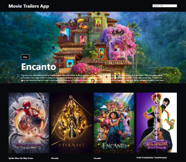
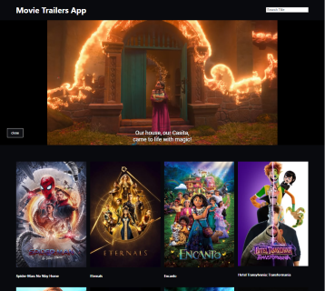

# Movie Trailers App with ReactJs

## Table of contents

- [Movie Trailers App with ReactJs](#movie-trailers-app-with-reactjs)
  - [Table of contents](#table-of-contents)
  - [Overview](#overview)
    - [Screenshots - Desktop Screen](#screenshots---desktop-screen)
    - [Links](#links)
    - [Built with](#built-with)
  - [Author](#author)

## Overview

Application to search and watch official movie trailers on youtube

### Screenshots - Desktop Screen

### Links

- [Live Site URL](https://movietrailersanaquinpm.netlify.app/)

### Built with

- Vitejs
- Semantic HTML5 markup
- CSS
- ReactJs
- Axios
- React-Youtube

## Author

- [LinkedIn](https://www.linkedin.com/in/pablo-mart%C3%ADn-anaqu%C3%ADn-24b28825/)
- Twitter - [@anaquinpm](https://www.twitter.com/anaquinpm)
